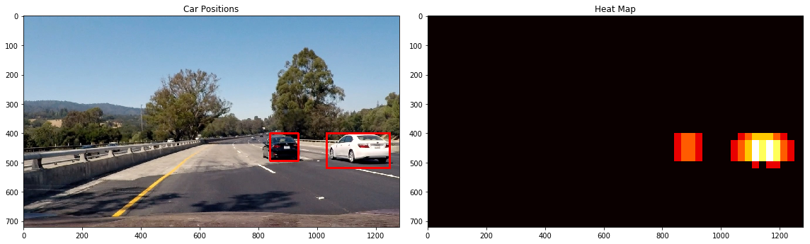
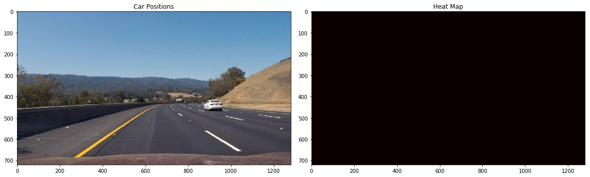
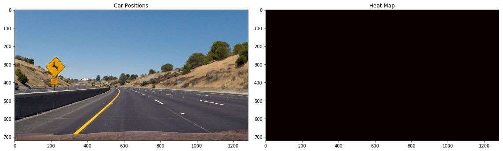
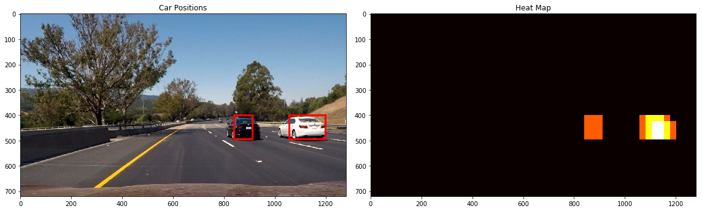

[//]: # (Image References)
[image1]: ./writeup_img/car_nocar.png
[image2]: ./writeup_img/hog.png
[image3]: ./writeup_img/windows.png
[image4]: ./writeup_img/example.png
[image5]: ./writeup_img/bboxes_and_heat.png
[image6]: ./writeup_img/labels_map.png
[image7]: ./writeup_img/output_bboxes.png
[video1]: ./project_video.mp4

---


### Histogram of Oriented Gradients (HOG)

#### 1. Explain how (and identify where in your code) you extracted HOG features from the training images.

The code for this step is contained in the first code cell of the IPython notebook `detection.ipynb`.  

I started by reading in all the `vehicle` and `non-vehicle` images.  Here is an example of one of each of the `vehicle` and `non-vehicle` classes:

![alt text][image1]

I then explored different color spaces and different `skimage.hog()` parameters (`orientations`, `pixels_per_cell`, and `cells_per_block`).  I grabbed random images from each of the two classes and displayed them to get a feel for what the `skimage.hog()` output looks like.

Here is an example using the `YCrCb` color space and HOG parameters of `orientations=9`, `pixels_per_cell=(8, 8)` and `cells_per_block=(2, 2)`:


![alt text][image2]

#### 2. Explain how you settled on your final choice of HOG parameters.

I tried various combinations of parameters and...

#### 3. Describe how (and identify where in your code) you trained a classifier using your selected HOG features (and color features if you used them).

I trained a linear SVM using linearSVC.
```
Using: 9 orientations 8 pixels per cell and 2 cells per block
Feature vector length: 6156
16.11 Seconds to train SVC...
Test Accuracy of SVC =  0.9923
Predictions:  [ 1.  1.  1.  1.  0.  0.  1.  1.  0.  1.]
Actual data:  [ 1.  1.  1.  1.  0.  0.  1.  1.  0.  1.]
0.00155 Seconds to predict 10 labels with SVC
```

### Sliding Window Search

#### 1. Describe how (and identify where in your code) you implemented a sliding window search.  How did you decide what scales to search and how much to overlap windows?

Several combinations of the sliding windows are considered as shown below. After trial for all of them the final sliding window parameters are choosen as xy_window=(96, 96), xy_overlap=(0.75, 0.75).

![alt text][image3]

#### 2. Show some examples of test images to demonstrate how your pipeline is working.  What did you do to optimize the performance of your classifier?

Ultimately I searched on two scales using YCrCb 3-channel HOG features plus spatially binned color and histograms of color in the feature vector, which provided a nice result.  Here are some example images:

![alt text][image4]
---

### Video Implementation

#### 1. Provide a link to your final video output.  Your pipeline should perform reasonably well on the entire project video.
Here's a [link to my video result](project_video_out.mp4)


#### 2. Describe how (and identify where in your code) you implemented some kind of filter for false positives and some method for combining overlapping bounding boxes.

I recorded the positions of positive detections in each frame of the video.  Here are one of the corresponding heatmaps comparing to the resulting bounding boxes are drawn onto the test image in the series:







---

### Discussion

#### 1. Briefly discuss any problems / issues you faced in your implementation of this project.  Where will your pipeline likely fail?  What could you do to make it more robust?

The pipeline has following issues:
1. High rate of false positive and negtives
2. The speed is very slow, it cannot work in real time.
3. The parameters are manually tuned, and is not general enough.
4. The predicted bounding boxes are not stable

For issues 1-3, my suggestion is to use deep learning algorithms (e.g. SSD, Yolo, faster RCNN, etc.) to replace the search window and svm;
For issue 4, my suggestion would be applying Kalman filter.
